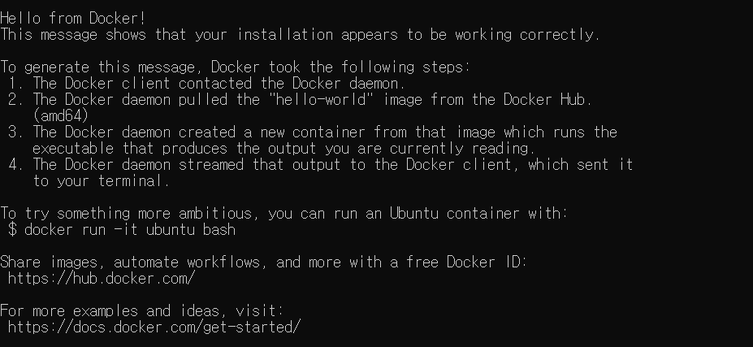
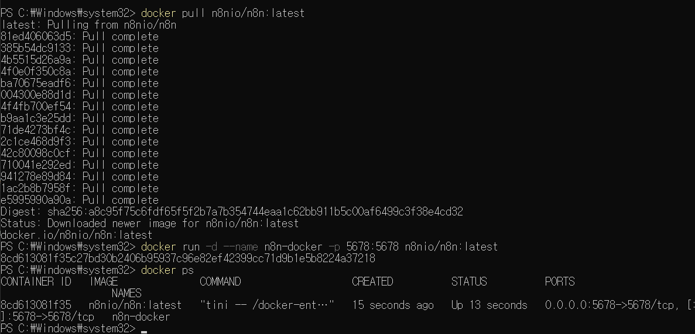
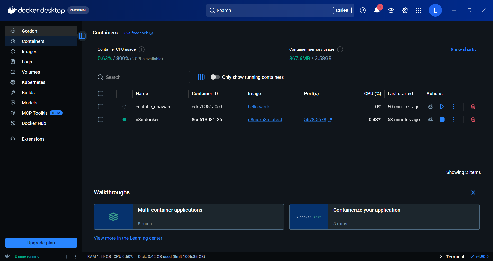
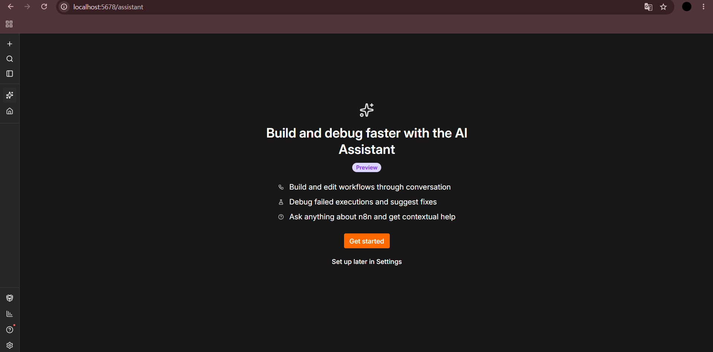
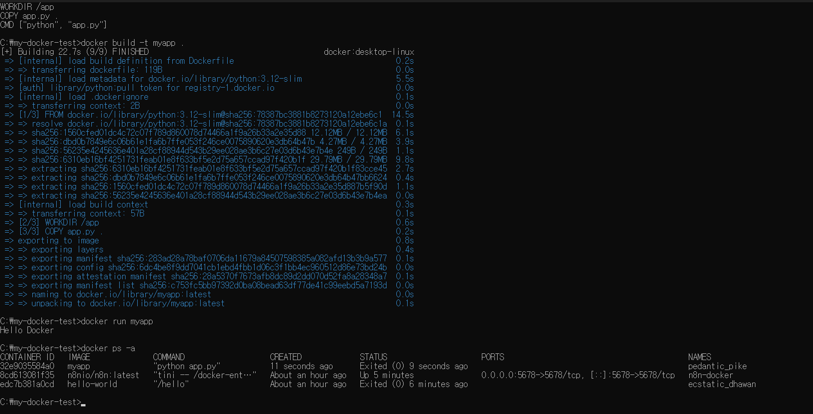
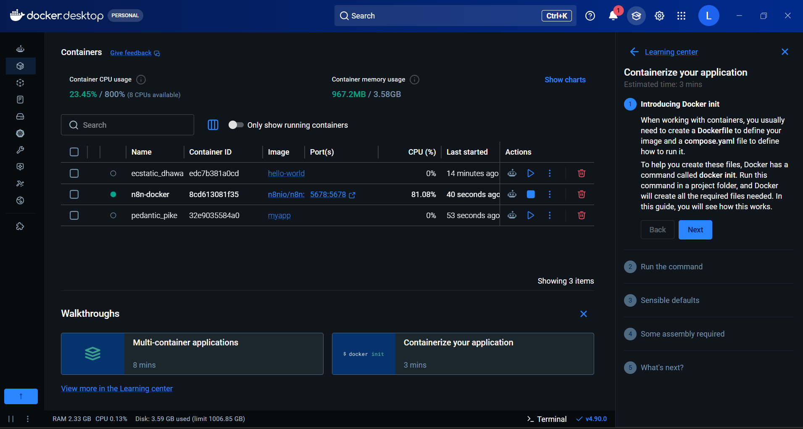

# DOCKER LAB NOTE

## Windows 환경에서 이미지 빌드부터 컨테이너 실행까지

**App Deployment · 2026 Fall**

| Student | Professor | Environment |
|:---:|:---:|:---:|
| Madina Yergeshbay | 조상구 교수님 | Windows 11 · WSL2 · Docker Desktop |

---

> **이번 실습의 핵심 질문**  
> Docker 이미지는 어떻게 준비하고, 그 이미지를 실제 컨테이너로 어떻게 실행하는가?

이 문서는 단순한 명령어 목록이 아니라 실제 실행 화면을 기준으로 **명령 → 결과 → 의미**를 연결한 실습 기록이다.

## LAB MAP

| STEP | 실습 내용 | 확인 결과 |
|:---:|---|:---:|
| 01 | Docker Engine 테스트 | Hello from Docker |
| 02 | n8n 이미지 다운로드 | Pull 완료 |
| 03 | n8n 컨테이너 실행 | STATUS: Up |
| 04 | 포트 연결과 웹 접속 | localhost:5678 성공 |
| 05 | Python과 Dockerfile 작성 | 빌드 준비 완료 |
| 06 | 사용자 이미지 빌드 | myapp:latest 생성 |
| 07 | myapp 실행 | Hello Docker |
| 08 | 이미지 레이어 분석 | Docker Desktop 확인 |

---

# STEP 01 — Docker 동작 확인

### Command

~~~powershell
docker run hello-world
~~~

Docker는 로컬에서 <code>hello-world</code> 이미지를 찾고, 이미지가 없으면 Docker Hub에서 내려받는다. 이후 새 컨테이너를 생성하여 테스트 프로그램을 실행한다.

화면에 다음 문장이 출력되었다.

~~~text
Hello from Docker!
This message shows that your installation appears to be working correctly.
~~~

따라서 Docker Client와 Engine 연결, 이미지 다운로드, 컨테이너 생성과 실행이 모두 정상임을 확인하였다.

  
   <b>Figure 1.</b> hello-world 컨테이너 실행 성공

Docker Desktop의 Images 메뉴에서 <code>hello-world:latest</code>를 열었다. <code>COPY hello</code>와 <code>CMD ["/hello"]</code> 레이어가 보이며 취약점은 0개로 표시되었다.

  
   <b>Figure 2.</b> hello-world 이미지 레이어 확인

> **MY NOTE 01**  
> 메시지를 출력한 뒤 컨테이너가 종료되는 것은 오류가 아니다. 작업을 정상적으로 완료했기 때문이다.

---

# STEP 02 — n8n 이미지 준비

### Command

~~~powershell
docker pull n8nio/n8n:latest
~~~

| 명령의 부분 | 의미 |
|---|---|
| <code>docker pull</code> | Registry에서 이미지 다운로드 |
| <code>n8nio/n8n</code> | 이미지 Repository |
| <code>latest</code> | 사용할 이미지 Tag |

여러 레이어에 <code>Pull complete</code>가 표시되고 마지막에 <code>Downloaded newer image</code>가 출력되어 다운로드가 완료되었다.

---

# STEP 03 — n8n 컨테이너 실행

### Command

~~~powershell
docker run -d --name n8n-docker -p 5678:5678 n8nio/n8n:latest
~~~

| 설정 | 내가 적용한 값 | 역할 |
|---|---|---|
| 실행 방식 | <code>-d</code> | 백그라운드 실행 |
| 컨테이너 이름 | <code>n8n-docker</code> | 자동 이름 대신 직접 지정 |
| 포트 | <code>5678:5678</code> | Host와 Container 연결 |
| 이미지 | <code>n8nio/n8n:latest</code> | 실행할 이미지 선택 |

실행 상태를 확인하였다.

~~~powershell
docker ps
~~~

결과에서 <code>STATUS: Up</code>과 <code>0.0.0.0:5678-&gt;5678/tcp</code>가 표시되었다.

  
   <b>Figure 3.</b> n8n 다운로드, 실행 및 상태 확인

### Port mapping

~~~text
Browser: localhost:5678
        ↓
Windows Host Port: 5678
        ↓
Docker Port Mapping
        ↓
n8n Container Port: 5678
~~~

<code>-p HOST:CONTAINER</code> 순서이므로, Windows의 5678번 포트로 들어온 요청이 n8n 내부의 5678번 포트로 전달된다.

---

# STEP 04 — n8n 실행 결과 검증

Docker Desktop의 Containers 화면에서 <code>n8n-docker</code> 앞에 초록색 실행 표시와 <code>5678:5678</code> 링크가 나타났다.

  
   <b>Figure 4.</b> Docker Desktop에서 확인한 실행 중인 n8n

Chrome에서 다음 주소를 열었다.

~~~text
http://localhost:5678
~~~

n8n AI Assistant 화면이 표시되었다. 컨테이너 내부 웹 애플리케이션과 포트 포워딩이 실제로 정상 동작한 것이다.

  
   <b>Figure 5.</b> localhost:5678을 통한 n8n 접속 성공

> **MY NOTE 02**  
> localhost는 외부 서버가 아니라 현재 사용 중인 내 컴퓨터를 의미한다.

---

# STEP 05 — Python 프로젝트 준비

### Project folder

~~~cmd
mkdir C:\my-docker-test
cd /d C:\my-docker-test
~~~

### app.py

~~~python
print("Hello Docker")
~~~

CMD에서 직접 만들 경우:

~~~cmd
echo print("Hello Docker") > app.py
~~~

### Folder structure

~~~text
C:\my-docker-test\
├── app.py
└── Dockerfile
~~~

두 파일을 같은 폴더에 둔 이유는 현재 폴더 전체가 Docker Build Context로 전달되기 때문이다.

---

# STEP 06 — 나만의 Dockerfile 작성

파일 이름은 확장자 없이 정확히 <code>Dockerfile</code>이다.

~~~dockerfile
FROM python:3.12-slim
WORKDIR /app
COPY app.py .
CMD ["python", "app.py"]
~~~

## Dockerfile을 한 줄씩 읽기

| Line | Instruction | 내가 이해한 역할 |
|:---:|---|---|
| 1 | <code>FROM python:3.12-slim</code> | Python 3.12 Linux 환경을 출발점으로 선택 |
| 2 | <code>WORKDIR /app</code> | 컨테이너의 기본 작업 위치를 /app으로 설정 |
| 3 | <code>COPY app.py .</code> | 내 Python 파일을 이미지 안으로 복사 |
| 4 | <code>CMD ["python", "app.py"]</code> | 컨테이너 시작 시 자동 실행할 명령 지정 |

CMD에서 Dockerfile을 직접 생성한 명령:

~~~cmd
echo FROM python:3.12-slim > Dockerfile
echo WORKDIR /app >> Dockerfile
echo COPY app.py . >> Dockerfile
echo CMD ["python", "app.py"] >> Dockerfile
type Dockerfile
~~~

<code>&gt;</code>는 파일을 새로 만들거나 덮어쓰고, <code>&gt;&gt;</code>는 기존 내용 아래에 새 줄을 추가한다.

---

# STEP 07 — myapp 이미지 빌드

### Command

~~~cmd
docker build -t myapp .
~~~

~~~text
docker build  = Dockerfile을 읽고 이미지 생성
-t myapp     = 이미지 이름을 myapp으로 지정
.            = 현재 폴더를 Build Context로 지정
~~~

마지막 점은 Dockerfile과 app.py가 있는 현재 폴더를 의미하므로 반드시 필요하다.

빌드 과정은 다음 순서로 진행되었다.

1. python:3.12-slim 준비
2. WORKDIR /app 적용
3. app.py 복사
4. CMD 저장
5. myapp:latest 이미지 생성

완료 화면에서 <code>naming to docker.io/library/myapp:latest</code>를 확인하였다.

---

# STEP 08 — myapp 실행과 결과 해석

### Run

~~~cmd
docker run myapp
~~~

### Output

~~~text
Hello Docker
~~~

Dockerfile의 CMD에 따라 컨테이너 내부에서 <code>python app.py</code>가 실행되었다.

모든 컨테이너 상태도 확인하였다.

~~~cmd
docker ps -a
~~~

  
   <b>Figure 6.</b> myapp 빌드, Hello Docker 출력, 상태 확인

### 왜 Exited (0)인가?

종료 코드 0은 오류가 아니라 **정상 종료**이다. app.py는 한 줄을 출력하면 모든 작업이 끝나므로 컨테이너도 종료된다.

| 프로그램 | 실행 특징 | 정상 상태 |
|---|---|---|
| hello-world | 테스트 메시지 출력 후 완료 | Exited (0) |
| myapp | Hello Docker 출력 후 완료 | Exited (0) |
| n8n | 웹 요청을 계속 기다림 | Up |

---

# STEP 09 — 세 컨테이너 최종 비교

Docker Desktop에서 이번 실습으로 만든 결과를 한 화면에서 확인하였다.

- hello-world: 설치 확인 완료
- n8n-docker: 5678 포트에서 실행 중
- myapp: Python 코드 실행 후 정상 종료

  
   <b>Figure 7.</b> hello-world, n8n, myapp 컨테이너 비교

<code>pedantic_pike</code>처럼 보이는 이름은 <code>--name</code>을 지정하지 않았을 때 Docker가 자동으로 만든 이름이다.

---

# STEP 10 — myapp 이미지 레이어 분석

Docker Desktop의 Images → myapp:latest에서 내가 작성한 Dockerfile 내용이 실제 레이어로 반영된 것을 확인하였다.

~~~text
WORKDIR /app
COPY app.py .
CMD ["python", "app.py"]
~~~

  
   <b>Figure 8.</b> 직접 작성한 Dockerfile과 myapp 레이어의 연결

이 결과는 **Dockerfile → Image Layer → Container 실행**의 관계를 보여 준다.

---

# STEP 11 — n8n 이미지 레이어 분석

n8n은 실제 웹 애플리케이션과 많은 패키지를 포함하므로 myapp보다 이미지 크기와 레이어 수가 더 크다.

레이어 목록에서 <code>EXPOSE [5678/tcp]</code>를 확인하였다. n8n이 내부에서 5678번 포트를 사용한다는 의미이며, 앞에서 사용한 포트 매핑과 연결된다.

  
   <b>Figure 9.</b> n8n 이미지의 레이어, 패키지와 5678 포트

| Image | 구조 | 특징 |
|---|---|---|
| hello-world | 매우 단순 | Docker 테스트용 최소 이미지 |
| myapp | Python + app.py | 직접 작성한 레이어 확인 가능 |
| n8n | 많은 패키지와 레이어 | 실제 웹 서비스, 5678 포트 사용 |

Vulnerabilities 화면은 이미지 패키지의 알려진 보안 문제를 보여 준다. 실제 배포에서는 최신 이미지 사용과 정기적인 보안 업데이트가 중요하다.

---

# MY COMMAND POCKET

~~~powershell
# 1. Docker 테스트
docker run hello-world

# 2. n8n 준비와 실행
docker pull n8nio/n8n:latest
docker run -d --name n8n-docker -p 5678:5678 n8nio/n8n:latest
docker ps

# 3. 프로젝트 이동
cd /d C:\my-docker-test

# 4. 직접 만든 이미지 빌드와 실행
docker build -t myapp .
docker run myapp
docker ps -a
~~~

| 추가 명령 | 사용 목적 |
|---|---|
| <code>docker images</code> | 로컬 이미지 목록 |
| <code>docker logs n8n-docker</code> | n8n 로그 확인 |
| <code>docker stop n8n-docker</code> | n8n 정지 |
| <code>docker start n8n-docker</code> | n8n 재시작 |
| <code>docker run --rm myapp</code> | 실행 종료 후 컨테이너 자동 삭제 |

---

# TROUBLESHOOTING NOTE

### Virtualization support not detected

1. 작업 관리자 → 성능 → CPU에서 가상화 상태 확인
2. Windows Subsystem for Linux 활성화
3. Virtual Machine Platform 활성화
4. 관리자 PowerShell에서 <code>wsl --update</code>
5. Windows와 Docker Desktop 재시작

### localhost:5678이 열리지 않을 때

~~~powershell
docker ps
docker logs n8n-docker
~~~

컨테이너가 Up인지, 포트가 5678→5678로 표시되는지 확인한다.

### Dockerfile을 찾지 못할 때

~~~cmd
cd /d C:\my-docker-test
dir
type Dockerfile
~~~

Dockerfile이 Dockerfile.txt로 저장되지 않았는지, app.py와 같은 폴더에 있는지 확인한다.

---

# DEEP DIVE 01 — Docker의 동작 원리

Docker를 사용하기 전에는 애플리케이션 실행에 필요한 Python 버전, 라이브러리, 환경 설정을 컴퓨터마다 직접 맞춰야 했다. 개발자의 컴퓨터에서는 정상 작동하지만 다른 컴퓨터에서는 버전 차이 때문에 오류가 발생할 수 있다.

Docker는 애플리케이션 코드와 실행 환경을 이미지 안에 함께 저장하여 이 문제를 줄인다. 같은 이미지를 사용하면 서로 다른 컴퓨터에서도 비교적 동일한 환경으로 실행할 수 있다.

## Docker 구성 요소의 역할

| 구성 요소 | 역할 | 이번 실습에서 확인한 내용 |
|---|---|---|
| Docker Client | 사용자가 명령을 입력하는 도구 | PowerShell에서 docker 명령 실행 |
| Docker Engine | 이미지와 컨테이너를 실제로 관리 | Docker Desktop 하단의 Engine running |
| Docker Hub | 공개 이미지를 저장하는 Registry | hello-world, n8n, Python 이미지 다운로드 |
| Dockerfile | 이미지 제작 순서를 기록한 파일 | Python 3.12, app.py, 실행 명령 정의 |
| Image | 실행 환경과 코드를 포함한 템플릿 | hello-world, n8n, myapp |
| Container | 이미지를 실제로 실행한 프로세스 | n8n-docker와 myapp 컨테이너 |

## 명령 전달 과정

~~~text
사용자
  ↓ PowerShell에서 명령 입력
Docker Client
  ↓ 요청 전달
Docker Engine
  ├─ 이미지가 있는지 확인
  ├─ 필요하면 Docker Hub에서 Pull
  ├─ 컨테이너 생성
  └─ 컨테이너 프로세스 실행
~~~

<code>docker run hello-world</code> 한 줄만 입력했지만 내부적으로는 이미지 검색, 다운로드, 컨테이너 생성, 프로그램 실행이라는 여러 작업이 진행되었다.

---

# DEEP DIVE 02 — Windows, WSL2, Docker Desktop

Docker 컨테이너는 Linux 기술을 기반으로 한다. 현재 실습 컴퓨터의 Host OS는 Windows 11이므로 WSL2가 Windows와 Linux 컨테이너 환경 사이를 연결한다.

## 실습 환경의 계층

~~~text
Windows 11
└── WSL2 Virtualization
    └── Linux Environment
        └── Docker Engine
            ├── hello-world Container
            ├── n8n Container
            └── myapp Container
~~~

### Windows 11

사용자가 PowerShell, CMD, Chrome, Docker Desktop을 실행하는 실제 Host 운영체제이다.

### WSL2

Windows 안에서 Linux 커널 환경을 제공한다. Docker Desktop은 이 환경을 이용하여 Linux 컨테이너를 실행한다.

### Docker Desktop

Docker Engine의 상태를 확인하고 이미지, 컨테이너, 로그, 볼륨을 GUI로 관리할 수 있게 한다. 명령어로 만든 결과도 Docker Desktop에 동일하게 표시된다.

### Linux Container

각 컨테이너는 다른 컨테이너와 분리된 프로세스로 실행된다. n8n과 myapp이 서로 다른 환경을 사용해도 한 컴퓨터에서 함께 실행할 수 있다.

> **MY NOTE 03**  
> 처음에 Virtualization support not detected 오류가 나타난 이유는 Docker Desktop이 Linux 컨테이너를 실행할 가상화 환경을 찾지 못했기 때문이다. WSL2와 가상화를 활성화한 후 Engine running 상태가 되었다.

---

# DEEP DIVE 03 — Image와 Container의 차이

처음에는 Image와 Container가 비슷해 보이지만 역할이 다르다.

## Image

- 변경하지 않고 보관되는 읽기 전용 템플릿
- 애플리케이션 코드와 실행 환경 포함
- 하나의 이미지로 여러 컨테이너 생성 가능
- 태그를 사용하여 버전 구분
- 실행되지 않아도 로컬에 저장 가능

## Container

- 이미지를 기반으로 만들어진 실행 인스턴스
- 실행, 정지, 재시작, 삭제 가능
- 고유한 Container ID와 이름 보유
- 프로세스가 끝나면 Exited 상태가 됨
- 같은 이미지에서 생성해도 각 컨테이너는 서로 구분됨

## 비교 예시

| 기준 | Image | Container |
|---|---|---|
| 비유 | 프로그램 설치 파일 | 실행 중인 프로그램 |
| 생성 명령 | docker pull / docker build | docker run |
| 상태 | 저장됨 | Created, Up, Exited |
| 이름 예시 | myapp:latest | pedantic_pike |
| 여러 개 생성 | 원본 역할 | 같은 이미지로 여러 개 가능 |

이번 실습에서 <code>myapp:latest</code>는 이미지이고, <code>pedantic_pike</code>는 그 이미지로 만든 컨테이너이다.

---

# DEEP DIVE 04 — docker pull과 docker run

## docker pull

~~~powershell
docker pull n8nio/n8n:latest
~~~

이 명령은 이미지를 로컬 저장소에 내려받기만 한다. 이미지가 다운로드되어도 아직 프로그램은 실행되지 않는다.

## docker run

~~~powershell
docker run n8nio/n8n:latest
~~~

이 명령은 이미지로 새 컨테이너를 만든 뒤 실행한다. 로컬에 이미지가 없다면 먼저 자동으로 Pull한 후 실행한다.

## 두 명령의 관계

~~~text
docker pull
    ↓
Image 저장
    ↓
docker run
    ↓
Container 생성
    ↓
Application 실행
~~~

명시적으로 Pull하면 다운로드 과정과 오류를 먼저 확인할 수 있다. 반면 Run만 사용하면 필요한 이미지를 Docker가 자동으로 준비하므로 간단한 테스트에 편리하다.

---

# DEEP DIVE 05 — Build Context와 점의 의미

~~~cmd
docker build -t myapp .
~~~

여기에서 마지막 점은 단순한 문장 부호가 아니다. 현재 디렉터리를 Docker Build Context로 전달하라는 경로 표현이다.

## Build Context에 포함된 파일

~~~text
C:\my-docker-test
├── Dockerfile  ← 빌드 순서
└── app.py      ← 이미지에 넣을 소스 코드
~~~

Docker Engine은 Build Context 안의 파일만 COPY할 수 있다. app.py가 다른 폴더에 있거나 점 대신 잘못된 경로를 지정하면 COPY 단계에서 파일을 찾지 못한다.

## 빌드 시 확인할 항목

1. 현재 경로가 C:\my-docker-test인지 확인
2. dir 명령으로 두 파일 확인
3. Dockerfile에 확장자가 붙지 않았는지 확인
4. COPY의 파일 이름과 실제 파일 이름 비교
5. build 명령 끝에 점 입력

~~~cmd
cd /d C:\my-docker-test
dir
type Dockerfile
docker build -t myapp .
~~~

---

# DEEP DIVE 06 — Docker 이미지 레이어

Docker 이미지는 여러 개의 레이어가 순서대로 쌓인 구조이다. Dockerfile의 명령이 변경되면 해당 단계와 그 이후 단계가 다시 빌드된다.

## myapp 레이어

~~~text
python:3.12-slim
        ↓
WORKDIR /app
        ↓
COPY app.py .
        ↓
CMD ["python", "app.py"]
        ↓
myapp:latest
~~~

### Layer cache

Dockerfile과 app.py가 변경되지 않았다면 Docker는 기존 레이어 캐시를 사용할 수 있다. 이 때문에 두 번째 빌드는 첫 번째 빌드보다 빨라질 수 있다.

### 레이어 순서가 중요한 이유

Dockerfile은 위에서 아래로 처리된다. FROM 없이 다른 명령을 먼저 실행할 수 없으며, WORKDIR을 먼저 지정했기 때문에 COPY된 app.py의 위치가 /app이 된다.

### Image size

myapp은 app.py 자체는 매우 작지만 Python 실행 환경을 포함하므로 hello-world보다 크다. n8n은 Node.js 기반 애플리케이션과 많은 패키지를 포함하므로 더 큰 이미지가 된다.

---

# DEEP DIVE 07 — CMD와 컨테이너 프로세스

Docker 컨테이너는 CMD로 실행한 주요 프로세스가 살아 있는 동안 실행 상태를 유지한다.

myapp의 기본 프로세스:

~~~text
python app.py
~~~

app.py는 Hello Docker를 한 번 출력한 뒤 끝난다. 주요 프로세스가 종료되므로 컨테이너도 Exited 상태가 된다.

n8n의 주요 프로세스는 웹 요청을 계속 기다린다. 따라서 사용자가 중지하지 않는 동안 Up 상태를 유지한다.

## 종료 코드

| Code | 일반적인 의미 |
|:---:|---|
| 0 | 정상 종료 |
| 1 | 일반적인 애플리케이션 오류 |
| 125 | Docker 실행 자체의 문제 |
| 126 | 명령을 실행할 권한이 없음 |
| 127 | 실행할 명령을 찾을 수 없음 |

이번 myapp의 <code>Exited (0)</code>은 정확히 기대한 결과이다.

---

# DEEP DIVE 08 — 포트 포워딩 상세 분석

컨테이너는 기본적으로 격리되어 있으므로 내부 포트가 존재해도 Windows 브라우저가 자동으로 접근할 수 없다. <code>-p</code> 옵션으로 외부에 연결해야 한다.

## 사용한 설정

~~~powershell
-p 5678:5678
~~~

| 위치 | 포트 | 역할 |
|---|:---:|---|
| Windows Host | 5678 | Chrome이 접속하는 포트 |
| n8n Container | 5678 | n8n 서비스가 기다리는 포트 |

## 서로 다른 번호도 가능

~~~powershell
docker run -d -p 8089:5678 --name n8n-test n8nio/n8n:latest
~~~

이 경우 컨테이너 내부 n8n은 여전히 5678 포트를 사용하지만 브라우저 주소는 다음과 같다.

~~~text
http://localhost:8089
~~~

교수님 자료의 8089:3000 예시도 같은 원리이다. 왼쪽은 내 컴퓨터의 Host 포트이고 오른쪽은 컨테이너 애플리케이션의 포트이다.

---

# DEEP DIVE 09 — 컨테이너 이름과 ID

각 컨테이너에는 긴 Container ID가 자동으로 부여된다. 긴 ID 대신 이름을 사용하면 명령을 입력하기 쉽다.

~~~powershell
docker stop n8n-docker
docker start n8n-docker
docker logs n8n-docker
~~~

<code>--name n8n-docker</code>를 사용했기 때문에 위 명령에서 ID를 복사하지 않고 이름을 사용할 수 있다.

myapp 실행 시에는 이름을 지정하지 않았기 때문에 Docker가 <code>pedantic_pike</code>라는 임의의 이름을 만들었다.

원하는 이름을 지정하려면:

~~~powershell
docker run --name my-python-container myapp
~~~

---

# DEEP DIVE 10 — 실행 중 컨테이너와 전체 컨테이너

## docker ps

현재 실행 중인 컨테이너만 보여 준다. n8n처럼 Up 상태인 서비스 확인에 적합하다.

~~~powershell
docker ps
~~~

## docker ps -a

실행 중인 컨테이너뿐 아니라 Exited 상태까지 모두 보여 준다. hello-world와 myapp의 실행 기록을 확인하려면 -a 옵션이 필요하다.

~~~powershell
docker ps -a
~~~

## 주요 출력 열

| 열 | 확인할 내용 |
|---|---|
| CONTAINER ID | 컨테이너 고유 식별자 |
| IMAGE | 컨테이너의 원본 이미지 |
| COMMAND | 컨테이너 내부에서 실행된 명령 |
| CREATED | 컨테이너 생성 시점 |
| STATUS | Up 또는 Exited 상태 |
| PORTS | Host와 Container 포트 연결 |
| NAMES | 사용자가 지정하거나 자동 생성된 이름 |

---

# DEEP DIVE 11 — 이미지 보안 화면 해석

Docker Desktop 이미지 상세 화면에는 Layers, Packages, Vulnerabilities 정보가 표시된다.

## Layers

이미지가 어떤 단계로 만들어졌는지 보여 준다. myapp 화면에서는 Dockerfile의 WORKDIR, COPY, CMD를 직접 확인하였다.

## Packages

이미지 안에 설치된 운영체제 패키지와 애플리케이션 패키지를 보여 준다.

## Vulnerabilities

포함된 패키지에서 공개적으로 알려진 보안 취약점을 표시한다. 숫자가 보인다고 해서 이번 실습이 실패한 것은 아니다. 사용한 베이스 이미지와 패키지 버전에 관련된 분석 결과이다.

## 실제 배포 시 개선 방법

- 최신 버전의 공식 이미지 사용
- 필요하지 않은 패키지 설치 금지
- slim 또는 alpine 계열 이미지 검토
- 정기적으로 이미지를 다시 Pull하고 Build
- 중요한 서비스는 취약점 목록 확인
- 비밀번호와 API Key를 Dockerfile 안에 직접 작성하지 않기

---

# DEEP DIVE 12 — 실습 결과로 확인한 실행 유형

이번 실습에는 서로 다른 세 종류의 애플리케이션이 포함되었다.

## One-shot test

<code>hello-world</code>는 Docker 설치 확인 메시지를 한 번 출력한다. 작업이 짧고 결과가 명확하다.

## One-shot Python application

<code>myapp</code>은 내가 작성한 Python 코드를 실행하고 한 줄을 출력한다. 실행 환경을 직접 이미지로 구성했다는 점에서 hello-world보다 한 단계 발전된 실습이다.

## Long-running web service

<code>n8n</code>은 사용자의 웹 요청을 계속 처리해야 하므로 백그라운드에서 지속적으로 실행된다. 포트 포워딩이 필요하다는 점도 앞의 두 컨테이너와 다르다.

| 구분 | hello-world | myapp | n8n |
|---|---|---|---|
| 이미지 출처 | Docker Hub | 직접 Build | Docker Hub |
| 주요 목적 | 설치 테스트 | Dockerfile 실습 | 웹 서비스 |
| 포트 필요 | 없음 | 없음 | 5678 |
| 실행 유지 | 아니요 | 아니요 | 예 |
| 최종 상태 | Exited | Exited | Up |

---

# EXPERIMENT LOG

| 순서 | 입력 또는 행동 | 화면에서 확인한 증거 | 판단 |
|:---:|---|---|---|
| 1 | Docker Desktop 실행 | Engine running | Docker Engine 준비 |
| 2 | docker run hello-world | Hello from Docker | 설치 정상 |
| 3 | docker pull n8nio/n8n:latest | Pull complete | 이미지 저장 성공 |
| 4 | docker run -d ... | Container ID 출력 | 컨테이너 생성 |
| 5 | docker ps | Up, 5678→5678 | n8n 실행과 포트 연결 |
| 6 | localhost:5678 접속 | n8n 화면 표시 | 웹 접근 성공 |
| 7 | app.py 작성 | Hello Docker 코드 | 소스 준비 |
| 8 | Dockerfile 작성 | 4개 Instruction | 이미지 설계 완료 |
| 9 | docker build -t myapp . | Build FINISHED | 이미지 생성 성공 |
| 10 | docker run myapp | Hello Docker | 코드 실행 성공 |
| 11 | docker ps -a | Exited (0) | 정상 종료 확인 |
| 12 | Images 상세 확인 | WORKDIR, COPY, CMD | 레이어 반영 확인 |

---

# EXPECTED QUESTIONS

### Q1. Dockerfile과 Image는 같은 것인가?

아니다. Dockerfile은 이미지를 만드는 방법을 적은 텍스트 파일이고, Image는 Dockerfile을 Build한 결과물이다.

### Q2. Image와 Container는 같은 것인가?

아니다. Image는 실행 전 템플릿이며 Container는 Image가 실제로 실행된 상태이다.

### Q3. 왜 myapp은 실행 직후 사라진 것처럼 보이는가?

사라진 것이 아니라 Exited 상태로 남아 있다. docker ps -a 명령으로 확인할 수 있다.

### Q4. 왜 n8n에는 -d가 필요한가?

n8n은 계속 실행되어야 하는 웹 서비스이다. -d를 사용하면 PowerShell을 점유하지 않고 백그라운드에서 실행할 수 있다.

### Q5. 5678:5678에서 왼쪽과 오른쪽은 무엇인가?

왼쪽은 Windows Host 포트, 오른쪽은 Container 내부 포트이다.

### Q6. Dockerfile의 점은 무엇인가?

COPY app.py . 에서 점은 현재 WORKDIR인 /app을 의미한다. docker build 명령 마지막의 점은 현재 Windows 프로젝트 폴더를 의미한다.

### Q7. latest는 무엇인가?

이미지의 태그이다. 별도의 버전을 지정하지 않을 때 자주 사용되지만, 실제 배포에서는 정확한 버전 태그를 사용하는 것이 더 안전하다.

### Q8. 하나의 이미지로 컨테이너를 여러 개 만들 수 있는가?

가능하다. docker run을 실행할 때마다 같은 이미지에서 새로운 컨테이너가 생성된다.

---

# FINAL REVIEW

~~~text
Dockerfile
    ↓ docker build
myapp:latest Image
    ↓ docker run
myapp Container
    ↓ CMD
Hello Docker
~~~

- [x] Docker Engine 동작 확인
- [x] hello-world 테스트
- [x] n8n 이미지 다운로드
- [x] n8n 백그라운드 실행
- [x] 5678 포트 매핑
- [x] 브라우저 접속
- [x] app.py와 Dockerfile 작성
- [x] myapp 이미지 빌드
- [x] Hello Docker 출력
- [x] 이미지 레이어 분석

## Conclusion

이번 실습을 통해 Dockerfile은 이미지의 제작 방법을 정의하고, 이미지는 컨테이너를 만들기 위한 템플릿이며, 컨테이너는 이미지를 실제로 실행한 프로세스라는 점을 확인하였다.

n8n에서는 Host와 Container 포트를 연결하여 브라우저에서 서비스에 접속하였다. 직접 만든 myapp에서는 Dockerfile의 각 명령이 이미지 레이어가 되고, docker run 시 CMD가 실행되어 Hello Docker가 출력되는 전체 과정을 확인하였다.

---

### END OF DOCKER LAB NOTE

**Dockerfile → Image → Container → Application**

